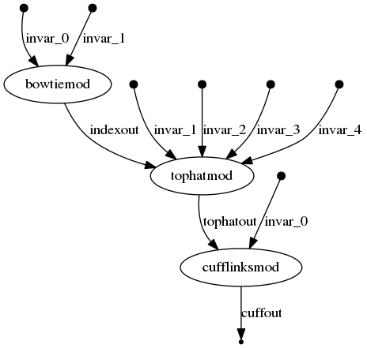

cwl2nxf
========

This is a prototype conversion tool from Common Workflow Language (CWL) to Nextflow. This project is still under active development, with a number of common CWL features implemented currently. Example workflows to demonstrate the conversion are included in the 'sample_data' folder with additional information on how to convert and run each exmaple. 

[](https://circleci.com/gh/nextflow-io/cwl2nxf/tree/master)


Supported features
-----------
* Parsing of CWL v1.0 documents. 
* Basic scatter support
* Support of 'runtime' and limited supported for 'inputs' JS evaluation
* secondaryFiles
* Conditional commandline inclusion.
	* In CWL if an input is null it is excluded from the commandline
* Commandline parsing supports default values and prefixs 
* InitialWorkDirRequirement: can handle files listed both for running locally and deployed to other compute resources. 

Unsupported features
-----------
* Parsing of CWL draft-3 or earlier specifications
* Subworkflows.
	* Currently each workflow step must be an individual CWL commandline tool file
* JS expressions are currently not implemented
* Record types
* outputBinding only supports 'glob'. outputEval and loadContents are unsupported.
	* limited support for outputEval is now functional
* import statements do not work.
* JS expressions for File type with checksum, size, format, contents are all not supported at this time

Building cwl2nxf
-----------

Note: Make sure to have Java 8 installed.

Clone this repository with the following command: 

```
git clone https://github.com/nextflow-io/cwl2nxf.git && cwl2nxf && export CWL2NXF_HOME=$PWD
```

Then build the project by using the following command:

```
./gradlew uberjar
```

Finally you can execute the `cwl2nxf` application as shown below:

```
cd sample_data/tutorial_tar_test
java -jar $CWL2NXF_HOME/build/libs/cwl2nxf-*.jar -o sample.nf wf.cwl wf.yml 
```

Upon execution `sample.nf` file will be created in the base folder. This file will then be runnable using Nextflow: 

```
nextflow run sample.nf
```


Development 
-----------

Compile and run from sources by using the following command:

```
./gradlew jar 
./launch.sh <wf.cwl> <wf.yml>
````

Debug the execution by using a remote debugger (eg. IntelliJ IDEA) as shown below: 

```
./launch.sh -remote-debug <wf.cwl> <wf.yml>
```


Run the code coverage by using the command: 

```
./gradlew cobertura  
```

The generated report is available at the following path: 

```
open ./build/reports/cobertura/index.html
```

Graphs
-----------
A comparison of native CWL graph to the Nextflow generated graph after conversion. 

CWL graph:


Nextflow graph after conversion:



License
-----------
The cwl2nxf is released under the Apache 2.0 License.
 
